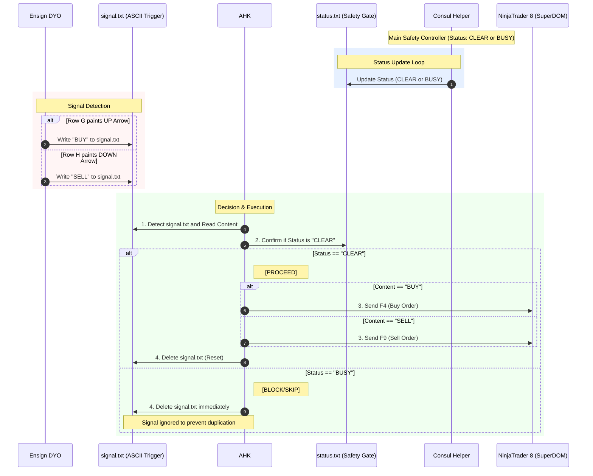

## NT8 Consul Helper Technical Integration Specification v1.0

#### **Step 1 Detect and Parse the Signal File**

The system monitors for the `signal.txt` file from Ensign. When an arrow paints, it reads the ASCII text (`BUY` or `SELL`) to determine the trade direction.

#### **Step 2 Verify the Safety Gate Status**

The AHK checks the `status.txt` file, which my **Consul Helper** refreshes every **100ms**. This step is the "Filter" that checks for any existing working orders in NinjaTrader.

#### **Step 3 Execution or Block**

- **If Status is CLEAR:** The system immediately sends the **F4** or **F9** hot-key to your NT8 SuperDOM to enter the trade.
- **If Status is BUSY:** The system recognizes that you already have a working order or position. To follow your "one position at a time" rule, it **Blocks** the execution and moves directly to Step 4.

#### **Step 4 Delete the Signal File (The Reset)**

Whether the trade was executed or blocked, the `signal.txt` file is **deleted immediately**. By deleting the file during a BUSY state, we effectively "Skip" that signal. This ensures that a new signal from Ensign does not sit waiting and accidentally trigger an order later when the previous trade closes.