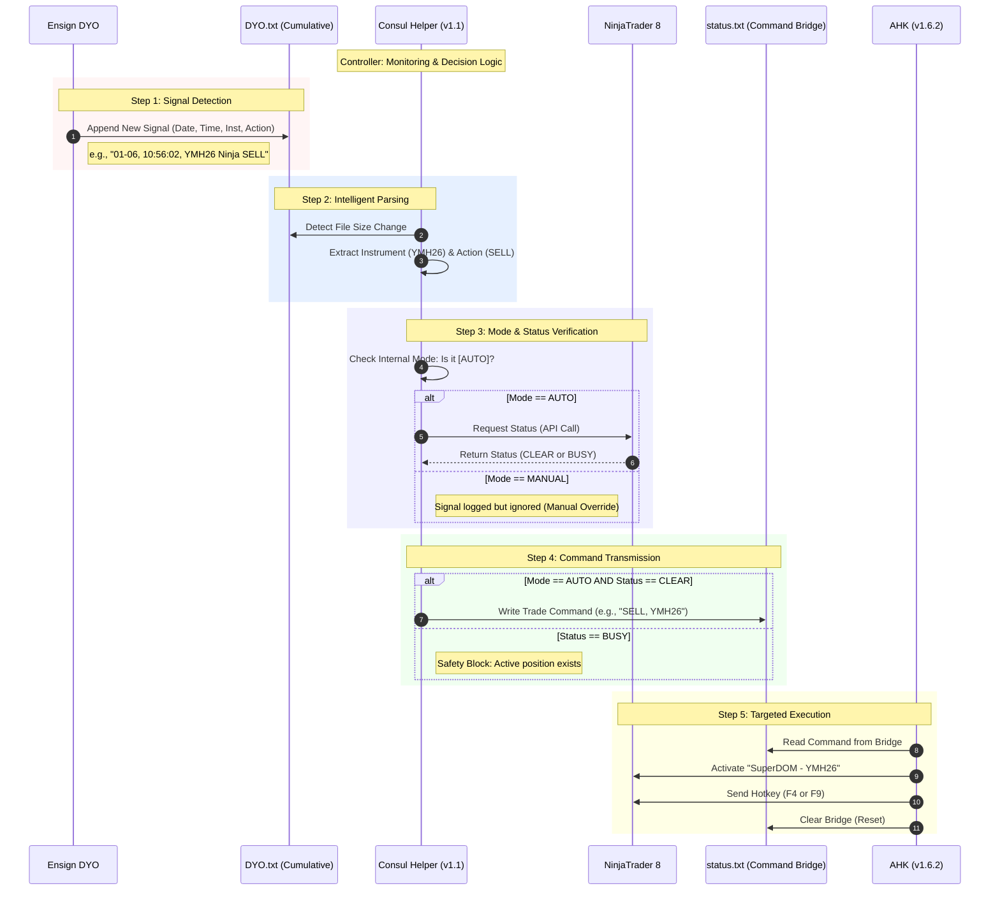

## NT8 Consul Helper Technical Integration Specification v1.1

#### **Step 1. Signal Detection & File Monitoring**

The **Consul Helper** monitors the `C:\Ensign10\OutputLog\DYO.txt` file in real-time by tracking changes in file size. Unlike the previous polling method, the system remains idle until a new signal line is appended to the file, ensuring zero-latency detection with minimal resource consumption.

#### **Step 2. Intelligent Signal Parsing**

When a new signal is detected, the Consul Helper parses the raw data line (e.g., `01-06, 10:56:02, YMH26 Ninja SELL`). It extracts three vital components.

- **Timestamp**: To ensure the signal is current.
- **Instrument Code**: Specifically identifying the target (e.g., `YMH26`) for precise window targeting.
- **Trade Action**: Determining the direction (`BUY` or `SELL`).

#### **Step 3. Real-time Status & Mode Verification**

Immediately after parsing, the Helper verifies the system's readiness based on two conditions:

- **Safety Gate (NT8 Status)**: It queries the NinjaTrader 8 API to confirm if the status is **"CLEAR"** (no existing orders or positions).
- **Operation Mode**: It checks if the UI is set to **"AUTO"** mode. If set to **"MANUAL"**, the signal is ignored to allow for discretionary trading.

#### **Step 4: Command Transmission to AHK**

If both conditions are met (Status: CLEAR & Mode: AUTO), the Consul Helper translates the signal into a specific execution command. It writes this command (e.g., `BUY, YMH26`) to the `status.txt` file, which acts as the bridge to the AHK script.

#### **Step 5: Targeted Hotkey Execution (AHK)**

The **AHK script** reads the command from `status.txt` and performs the final execution:

- **Window Targeting**: It identifies and activates the exact NinjaTrader window matching the instrument (e.g., `SuperDOM - YMH26`).
- **Hotkey Trigger**: It sends the corresponding hotkey (**F4** for Buy, **F9** for Sell) directly to the target window to enter the market.